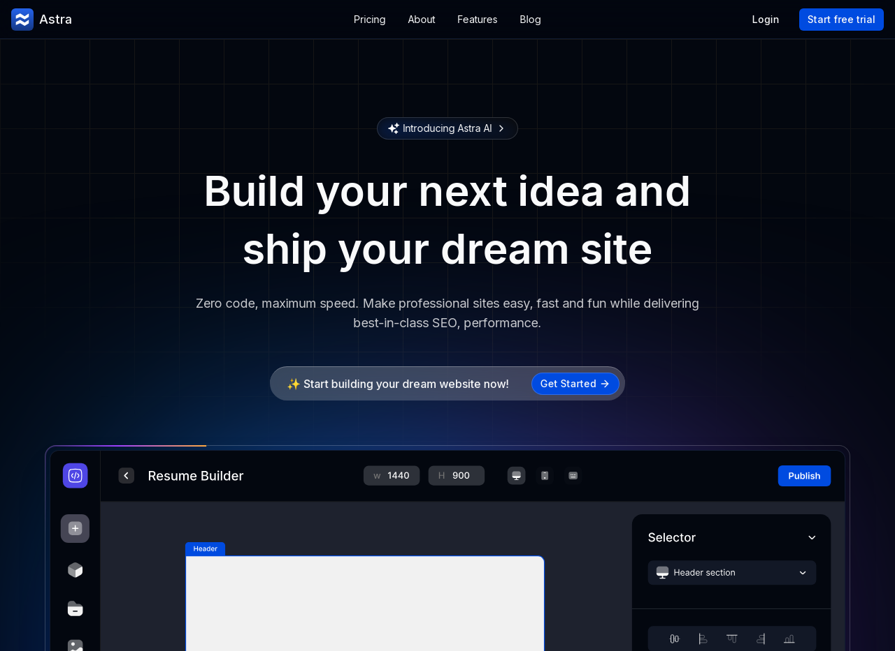

<h1 align="start">
  Astra - AI Powered Website Builder
</h1>

<p align="center">
  
</p>


## Introduction

Astra is a modern, fully responsive website built with a powerful tech stack. This project showcases the use of Next.js for server-side rendering, TailwindCSS for sleek styling, shadcn UI for elegant components, and Clerk for secure authentication.

## Tech Stack

- **Next.js**: For building the React-based website.
- **TailwindCSS**: For styling with utility-first CSS.
- **Shadcn UI**: For UI components.
- **Magic UI**: For UI components.
- **Clerk**: For user authentication.

## Quick Start

### Prerequisites
Make sure that you have installed
- Node.js
- Git
- npm / yarn / pnpm / bun

1. Clone this repository:

   ```bash
   git clone https://github.com/imjishan/astra-pro.ai.git
   cd astra-pro.ai
   ```
2. Install dependencies:
   ```bash
   npm install
   ```
3. Setup env variables:
   ```bash
    # app
    NEXT_PUBLIC_URL=http://localhost:3000
    NEXT_PUBLIC_DOMAIN=localhost:3000
   
    # clerk
    CLERK_SECRET_KEY=
    NEXT_PUBLIC_CLERK_PUBLISHABLE_KEY=
    NEXT_PUBLIC_CLERK_SIGN_IN_URL=/sign-in
    NEXT_PUBLIC_CLERK_SIGN_UP_URL=/sign-up
    NEXT_PUBLIC_CLERK_AFTER_SIGN_IN_URL=/
    NEXT_PUBLIC_CLERK_AFTER_SIGN_UP_URL=/
   ```
5. Run the development server:
   ```bash
   npm run dev
   ```
6. Open your browser and navigate to http://localhost:3000 to see the website in action.

